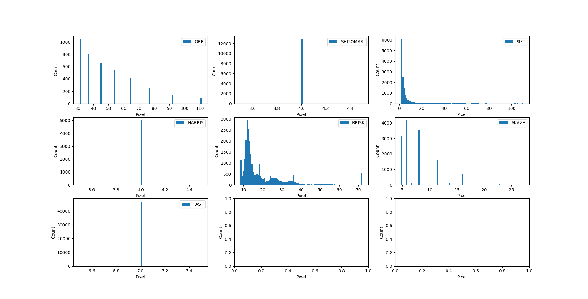

# Midterm Report: Camera Based 2D Feature Tracking

This report is submitted to meet the requirements of the Udacity sensor fusion course.

## Task 1: Data Buffer

I chose to use a double ended queue data structure from the standard template library (STL). This approach saves a lot of time and effort by removing the need to implement my own ring buffer (in many cases, the deque structure is implemented internally as a ring buffer anyway) and maintaining compatibility with other STL algorithms without having to re-implement the iterator specific funtions. The primary disadvantage of this approach is that the user must monitor the size of the buffer, and remember to pop data off of it to prevent running out of memory. I feel that this is an acceptable trade off given that the focus of this course project is understanding 2D feature tracking and not data structure development.

## Task 2: Keypoint Detection

Using OpenCV, this extension was straightforward. I refactored the existing code into a Detector class in the matching2D files. This Detector class takes a string in the constructor which I process to try to match against common spelling and capitilizations. For now, all of the implemented keypoint detectors use the default parameters (athough I have explicitely broken them out in the code so I can change them easily later). This should be extendable in future if I need to modify detector parameters at runtime.

## Task 3: Cropping

I used the OpenCV Region Of Interest "contains" function and the keypoints pt member variable to deterimine if the keypoint is inside the region of interest. This is turned off by default.

## Task 4: Descriptors:

I followed a similiar pattern for the descriptors as I did for the keypoint detectors. I put the methods into a single Detector class that accepts strings on construction. Default parameters for the descriptor settings were used. It might make sense to combine the detection and description steps into a single class as there is a lot of common code between the two. 

## Task 5: Matching:

Similiar to keypoint detection and the descriptor implementation, I moved the matching code into it's own class.

## Task 6: Distance Matching Test:

This code was included in the Matcher class. The distance ratio was hard coded to a value of 0.8, but could easily be made adjustable if needed.

## Task 7: Keypoint # and Size Distribution

Below is a summary of the mean # of keypoints for each descriptor type, and histograms showing the size distribution of the keypoints for each detector_type:

Keypoint Detector Type | Average # Keypoints
-----------------------|--------------------
SHITOMASI | 1288
HARRIS | 499
FAST | 4679
BRISK | 2711
ORB | 396
AKAZE | 1343
SIFT | 1323

It looks like that FAST and BRISK algorithms produce the most number of keypoints, and that the ORB, SIFT, BRISK and AKAZE detectors can identify features at different scales (or, at least, label the keypoints with a size).

## Task 8: Matched Points

More important that the total points is the number of matched points we can do something with. Below is a table showing the mean number of matched points over 10 images (keypoint algorithm along the top, descriptors down the side).

|          | Shi-Tomasi | Harris | FAST | BRISK | ORB | AKAZE | SIFT |
|----------|------------|--------|------|-------|-----|-------|------|
| BRISK    | 1161       | 449    | 4205 | 2444  | 354 | 1209  | 1189 |
| BRIEF    | 1108       | 436    | 3941 | 2418  | 450 | 1209  | 1134 |
| ORB      | 1097       | 433    | 3888 | 2406  | 450 | 1207  | x    |
| FREAK    | 1122       | 439    | 4017 | 2072  | 148 | 1209  | 1130 |
| AKAZE    | x          | x      | x    | x     | x   | 1209  | x    |
| SIFT     | 1342       | 461    | 4420 | 2444  | 450 | 1209  | 1243 |

The SIFT descriptor consistently gives the largest number of matches per keypoint of all the descriptors. The FAST descriptor seems to give the most number of matched keypoints. AKAZE descriptors only work with AKAZE features. SIFT features cause a memory exception with ORB descriptors.

In terms of total calculation time, the following table summarizes the results:

|          | Shi-Tomasi | Harris | FAST | BRISK  | ORB  | AKAZE | SIFT  |
|----------|------------|--------|------|--------|------|-------|-------|
| BRISK    |  45.92     | 36.29  | 75.50| 113.45 | 41.00| 86.10 | 123.13|
| BRIEF    |  14.25     | 9.07   | 14.38| 71.28  | 7.57 | 51.37 | 88.28 |
| ORB      |  17.16     | 11.39  | 12.87| 78.73  | 18.00| 55.83 | x     |
| FREAK    |  38.39     | 31.82  | 56.04| 97.78  | 29.00| 76.01 | 114.20|
| AKAZE    |  x         | x      | x    | x      | x    | 88.59 | x     |
| SIFT     |  26.21     | 20.16  | 90.54| 164.64 | 65.78| 79.24 | 148.91|
|----------|------------|--------|------|--------|------|-------|-------|

The three fastest combinations of (detector, descriptor) are:

1. (ORB, BRIEF) - 7.57 ms (450 matches)
2. (HARRIS, BRIEF) - 9.07 ms (436 matches)
3. (HARRIS, ORB) - 11.39 ms (433 matches)

However, the above performance seems to be associated with a low number of matched keypoints. Perhaps a better measure to rank by would be time / keypoint. In this case, the top performing detector/descriptors are:

1. (FAST, ORB) - 3.30 us/matched keypoint (12.82 ms/3888 matched keypoints)
2. (FAST, BRIEF) - 3.58 us/matched keypoint (14.1028 ms/3941 matched keypoints)
3. (SHITOMASI, BRIEF) - 12.78 us/matched keypoint (14.14 ms/1108 matched keypoints)

## Conclusion:

Given only the information above, I would probably choose a FAST/ORB combination of detector/descriptor to maximize the time per keypoint. Furthermore, this combination is only slightly outside the top 3 absolute performers, while providing almost 10X more matched features to work with. More information on the positivity rates for this combination could change this choice. 
